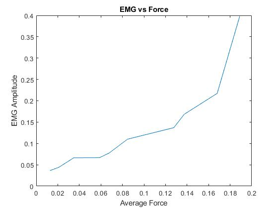
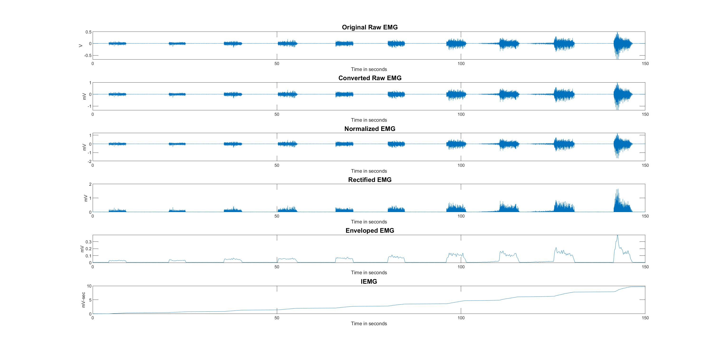
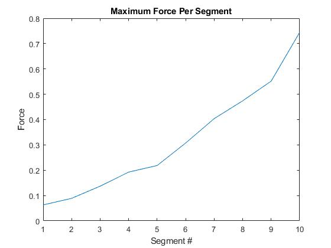
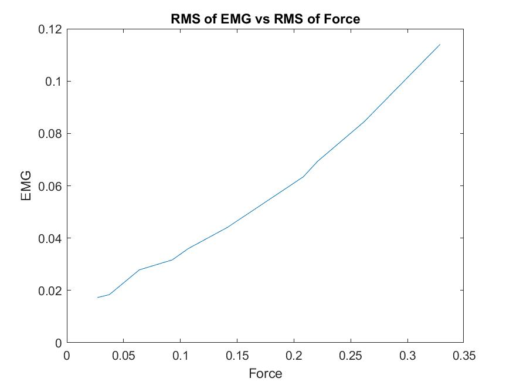

# ForceEMG-Relationship

These files correlate to an analysis of the foce-emg relationship during muscular activity. EMGs represent the electrical activity of skeletal muscles and are acquired by measuring the potential difference between two locations on the muscle. 

Data:
The data was obtained from Ryerson University lab exercise from an experiment to examine the relationship between muscle activity and force exertion. The experiment examines the relationship between the tibialis anterior (TA) muscle and the force exertion during isometric dorsiflexion. 

EMG signals and forces were acquired simultaneously at the sampling frequency (fs) of 2000Hz. EMG signals were acquired using surface EMG. Before acquisition EMG signals were amplified with a total amplifier gain of 500 (G=500). Forces were acquired and converted to Newtons (N).

During the experimental protocol MVC was performed and EMG values on the TA muscle as well as the forces were recorded (DATA: “mvc_ta_emg” and “mvc_ta_force”). These were used to norlaize the EMG and force values. EMG and force normalization was done by dividing EMG and force with MVC EMG and MVC Force respectively.

Subsequently, the experiment was conducted to represent the relationship. The experiment was done by performing increasingly stronger isometric dorsiflexion movements. The participant was asked to perform between 8 and 10 contractions of increasing intensity, each followed by a resting period (DATA: “increase_ta_emg” and “increase_ta_force”).

**Some Key Graphs** 

	

MedianFreq.jpg	Add files via upload	12 seconds ago
MedianFrequency.jpg	Add files via upload	12 seconds ago
NormalizedForce.jpg	Add files via upload	12 seconds ago

Ackowelagements:

Rehabilitation Engineering Laboratory, Toronto Rehab Institute and Dr. Dimity G. Sayenko, M.D.

References:

[1] Konrad P. (2005) The ABC of EMG: a practical introduction to kinesiological electromyography. Scottsdale, AZ.
[2] De Luca CJ. (1997) The Use of Surface Electromyography in Biomechanics. Journal of Applied Biomechanics. 13: 135-163.
[3] Angkoon P, Sirinee T, Huosheng H, Pornchai P and Chusak (2012). The Usefulness of Mean and Median Frequencies in Electromyography Analysis, Computational Intelligence in Electromyography Analysis, IntechOpen.
